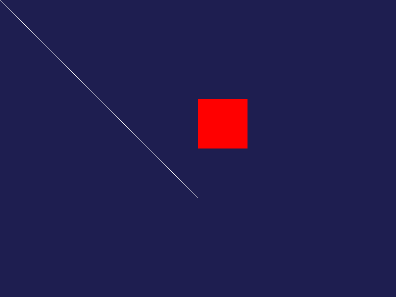

# Software Rasterizer

A 3D software renderer built from scratch in C++ without graphics APIs (no OpenGL/DirectX).

## Features (Planned)

- [x] Framebuffer and pixel rendering
- [ ] Line drawing (Bresenham's algorithm)
- [ ] Triangle rasterization
- [ ] 3D wireframe rendering
- [ ] Z-buffering
- [ ] Lighting and shading
- [ ] Texture mapping
- [ ] .OBJ model loading

## Build Instructions

### Requirements

- CMake 3.15+
- C++17 compatible compiler (GCC, Clang, MSVC)

### Building

```bash
mkdir build
cd build
cmake ..
cmake --build .
```

## Learning Goals

Understanding graphics pipeline fundamentals before diving into OpenGL/game development.

---

## Progress Gallery

### Milestone 1: Framebuffer Implementation



- Implemented pixel buffer with RGBA color support
- Line and shape drawing
- PNG export functionality
