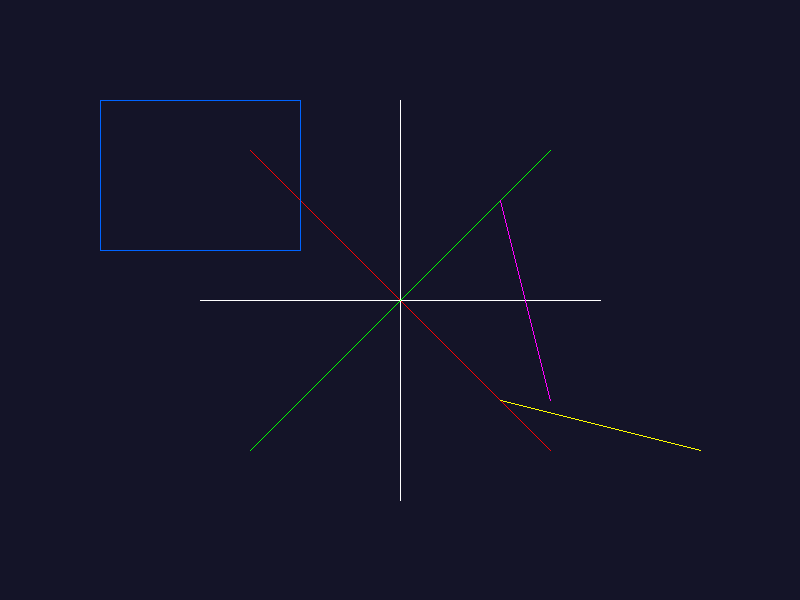
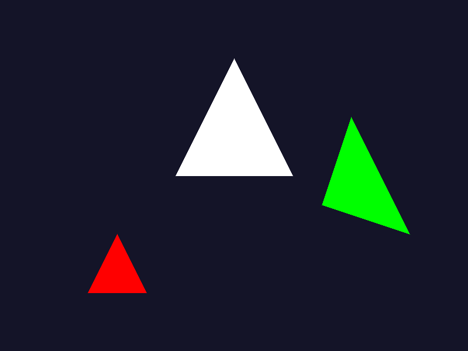
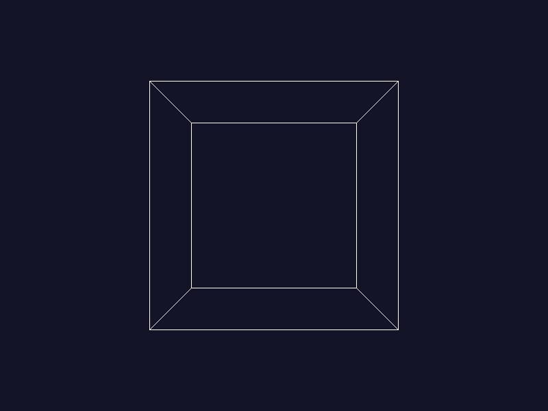

# Software Rasterizer

A 3D software renderer built from scratch in C++ without graphics APIs (no OpenGL/DirectX).

## Features (Planned)

- [x] Framebuffer and pixel rendering
- [x] Line drawing (Bresenham's algorithm)
- [x] Triangle rasterization
- [x] 3D wireframe rendering
- [ ] Z-buffering
- [ ] Lighting and shading
- [ ] Texture mapping
- [ ] .OBJ model loading

## Build Instructions

### Requirements

- CMake 3.15+
- C++17 compatible compiler (GCC, Clang, MSVC)

### Building

```bash
mkdir build
cd build
cmake ..
cmake --build .
```

## Learning Goals

Understanding graphics pipeline fundamentals before diving into OpenGL/game development.

---

## Progress Gallery

### Milestone 1: Framebuffer Implementation


- Implemented pixel buffer with RGBA color support
- Line and shape drawing
- PNG export functionality

### Milestone 2: Bresenhams line algorithm



- Implemented Bresenham's Algorithm
- Created Draw function to draw via Algorithm
- Drawing multiple lines via selected spots in the coordinate system

### Milestone 3: Triangle Rasterization



- Implemented scanline filling algorithm
- Vertex sorting and edge interpolation
- Handles all triangle orientations

### Milestone 4: 3D wireframe rendering



- Implemented Vector, Mesh and Matrix functionality
- using the new functionality to create a Wireframe Mesh